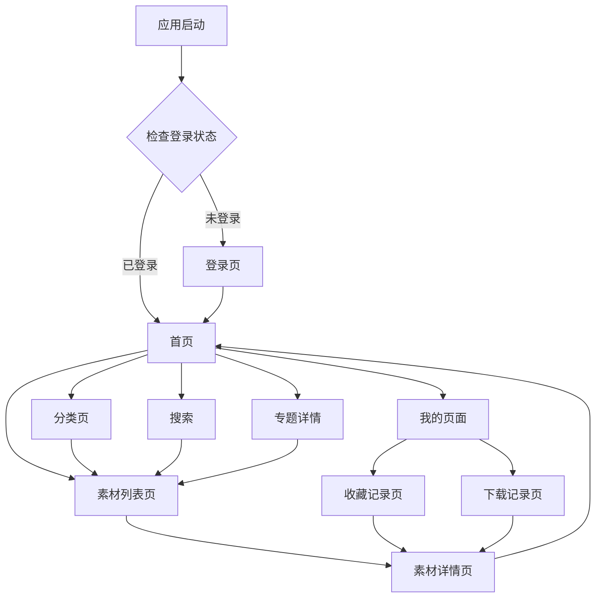

# 移动端素材库产品需求文档

## 1. 产品概述

移动端H5素材库是一个专为教育机构和医疗机构设计的素材管理平台，用户可以便捷地浏览、搜索、收藏和下载图片、视频、课件等教学和宣传素材。
- 解决教育和医疗机构素材分散、查找困难的问题，为教师、医护人员等专业用户提供统一的素材获取平台。
- 目标是提升素材使用效率，降低内容制作成本，支持移动端随时随地访问。

## 2. 核心功能

### 2.1 用户角色

| 角色 | 注册方式 | 核心权限 |
|------|----------|----------|
| 普通用户 | 用户名密码注册/微信小程序授权 | 浏览素材、搜索、收藏、下载 |

### 2.2 功能模块

本素材库需求包含以下主要页面：
1. **登录页**：用户身份验证，支持密码登录和微信小程序授权登录。
2. **首页**：搜索入口、一级分类导航、专题横向滚动展示、三类精选素材展示。
3. **分类页**：左侧一级分类列表、右侧二级分类展示、搜索过滤功能。
4. **我的页面**：用户信息展示、我的下载、我的收藏入口。
5. **素材列表页**：搜索条、过滤条件、素材网格展示、排序功能。
6. **素材详情页**：素材预览、详细信息、作者介绍、下载收藏分享操作。
7. **收藏记录页**：用户收藏的素材列表，支持分类筛选。
8. **下载记录页**：用户下载历史记录，支持分类筛选。

### 2.3 页面详情

| 页面名称 | 模块名称 | 功能描述 |
|----------|----------|----------|
| 登录页 | 登录表单 | 用户名密码登录，验证码验证，微信小程序授权登录 |
| 登录页 | 路由守卫 | 未登录用户自动跳转，登录成功后返回原页面 |
| 首页 | 搜索栏 | 点击进入搜索状态，输入关键词跳转素材列表页 |
| 首页 | 一级分类 | 显示图片、视频、课件三个主要分类，点击跳转对应素材列表 |
| 首页 | 专题展示 | 横向滚动的专题卡片，显示专题封面和名称，点击进入专题详情 |
| 首页 | 精选素材 | 分别展示图片、视频、课件的精选内容，每类显示4-6个，点击更多跳转列表页 |
| 首页 | 底部导航 | TabBar导航，包含首页、分类、我的三个选项 |
| 分类页 | 一级分类 | 左侧垂直列表，显示主要分类，点击切换右侧内容 |
| 分类页 | 搜索功能 | 顶部搜索框，前端过滤分类名称，无需调用接口 |
| 分类页 | 二级分类 | 右侧网格布局，显示选中一级分类下的子分类，点击跳转素材列表 |
| 我的页面 | 用户信息 | 显示头像、姓名、部门信息 |
| 我的页面 | 功能入口 | 我的下载、我的收藏两个功能入口 |
| 素材列表页 | 搜索栏 | 顶部搜索输入框和搜索按钮 |
| 素材列表页 | 过滤条件 | 全部、图片、视频、课件四个筛选标签 |
| 素材列表页 | 排序功能 | 专题进入时显示综合排序、热门下载选项 |
| 素材列表页 | 素材网格 | 瀑布流布局，显示素材缩略图和标题，点击进入详情页 |
| 素材详情页 | 素材预览 | 顶部大图展示素材内容或封面 |
| 素材详情页 | 素材信息 | 标题、描述、分类、上传时间等详细信息 |
| 素材详情页 | 作者信息 | 作者头像、姓名、简介 |
| 素材详情页 | 操作栏 | 自定义底部栏，包含返回首页、收藏、立即下载、分享按钮 |
| 收藏记录页 | 筛选标签 | 全部、图片、视频、课件四个分类筛选 |
| 收藏记录页 | 素材列表 | 网格布局展示收藏的素材，显示缩略图和标题 |
| 下载记录页 | 筛选标签 | 全部、图片、视频、课件四个分类筛选 |
| 下载记录页 | 素材列表 | 网格布局展示下载过的素材，显示缩略图和标题 |

## 3. 核心流程

### 用户操作流程

**主要用户流程**：
1. 用户访问应用 → 检查登录状态 → 未登录跳转登录页 → 登录成功返回目标页面
2. 首页浏览 → 点击分类/搜索/专题 → 进入素材列表 → 选择素材 → 查看详情 → 下载/收藏
3. 分类浏览 → 选择一级分类 → 查看二级分类 → 点击进入素材列表 → 后续流程同上
4. 个人中心 → 查看下载/收藏记录 → 点击素材 → 查看详情

## 4. 用户界面设计

### 4.1 设计风格

- **主色调**：蓝色系 (#1890FF) 作为主色，白色 (#FFFFFF) 作为背景色
- **辅助色**：灰色系 (#F5F5F5, #D9D9D9) 用于分割线和次要信息
- **按钮样式**：圆角矩形按钮，主要按钮使用蓝色背景白色文字
- **字体**：系统默认字体，标题16px，正文14px，辅助信息12px
- **布局风格**：卡片式设计，网格布局，底部TabBar导航
- **图标风格**：线性图标，简洁现代，与整体设计风格保持一致

### 4.2 页面设计概览

| 页面名称 | 模块名称 | UI元素 |
|----------|----------|--------|
| 首页 | 搜索栏 | 白色背景圆角搜索框，右侧蓝色搜索按钮，占满屏幕宽度 |
| 首页 | 分类导航 | 三个圆形图标按钮，图片、视频、课件，下方显示分类名称 |
| 首页 | 专题展示 | 横向滚动卡片，每个卡片显示专题封面图和标题文字叠加 |
| 首页 | 精选素材 | 每类素材一个区块，标题+更多按钮，下方2x2网格展示素材缩略图 |
| 分类页 | 一级分类 | 左侧固定宽度列表，选中项蓝色背景，未选中白色背景 |
| 分类页 | 二级分类 | 右侧网格布局，圆角卡片样式，显示分类图标和名称 |
| 我的页面 | 用户信息 | 顶部卡片，左侧圆形头像，右侧姓名和部门信息 |
| 我的页面 | 功能入口 | 两个并排的功能卡片，图标+文字的形式 |
| 素材列表页 | 过滤标签 | 横向排列的圆角标签，选中蓝色背景，未选中灰色边框 |
| 素材列表页 | 素材网格 | 瀑布流布局，每个素材卡片包含缩略图和底部标题区域 |
| 素材详情页 | 操作栏 | 自定义底部栏，左侧返回和收藏图标，右侧下载和分享按钮 |

### 4.3 响应式设计

项目采用移动端优先设计，主要适配手机屏幕尺寸，支持触摸交互优化。所有交互元素都考虑了手指点击的最小尺寸要求，确保良好的移动端用户体验。