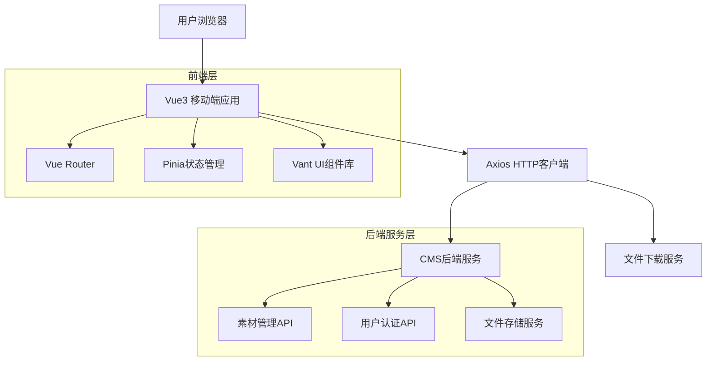
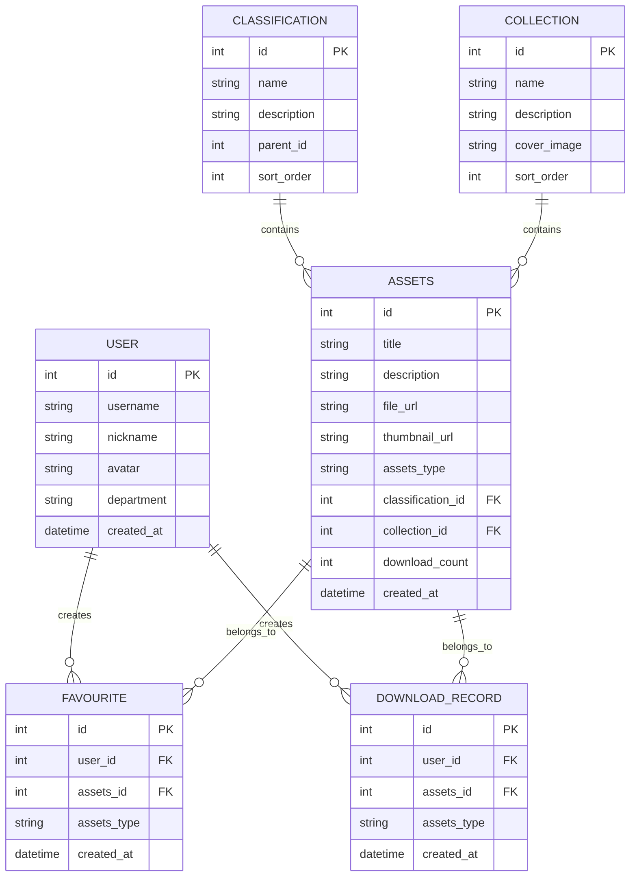

# 移动端素材库技术架构文档

## 1. 架构设计



## 2. 技术描述

- **前端框架**: Vue@3 + TypeScript + Vite
- **UI组件库**: Vant@4 (移动端UI组件库)
- **路由管理**: Vue Router@4
- **状态管理**: Pinia
- **HTTP请求**: Axios
- **样式方案**: Tailwind CSS + Sass
- **构建工具**: Vite
- **移动端适配**: Viewport + Flexible布局
- **图标库**: @vant/icons

## 3. 路由定义

| 路由 | 用途 |
|------|------|
| /login | 登录页面，支持密码登录和微信小程序授权 |
| / | 首页，重定向到 /home |
| /home | 首页，显示搜索、分类、专题和精选素材 |
| /category | 分类页面，左侧一级分类，右侧二级分类 |
| /profile | 我的页面，用户信息和功能入口 |
| /assets | 素材列表页面，支持搜索、筛选、排序 |
| /assets/:id | 素材详情页面，显示素材详细信息和操作 |
| /collections | 专题详情页面，显示专题下的素材列表 |
| /favorites | 我的收藏页面，显示用户收藏的素材 |
| /downloads | 我的下载页面，显示用户下载记录 |

## 4. API定义

### 4.1 核心API

**用户认证相关**
```
POST /client/login
```

请求参数：
| 参数名 | 参数类型 | 是否必填 | 描述 |
|--------|----------|----------|---------|
| username | string | true | 用户名/手机号/邮箱 |
| password | string | true | 登录密码 |
| captcha | string | true | 验证码 |
| captchaKey | string | true | 验证码标识键 |

响应数据：
| 参数名 | 参数类型 | 描述 |
|--------|----------|---------|
| token | string | 访问令牌 |
| refreshToken | string | 刷新令牌 |
| userInfo | object | 用户基本信息 |

**微信小程序登录**
```
POST /client/login/wechat/applet
```

请求参数：
| 参数名 | 参数类型 | 是否必填 | 描述 |
|--------|----------|----------|---------|
| code | string | true | 微信授权码 |

**获取验证码**
```
GET /client/CAPTCHA/code
```

请求参数：
| 参数名 | 参数类型 | 是否必填 | 描述 |
|--------|----------|----------|---------|
| key | string | true | 验证码标识键 |

**素材分类管理**
```
GET /client/assets/classification
```

响应示例：
```json
{
  "code": 200,
  "data": [
    {
      "id": 1,
      "name": "图片分类",
      "description": "图片素材分类"
    }
  ]
}
```

**素材专辑管理**
```
GET /client/assets/collection
```

**图片素材管理**
```
GET /client/assets/image
GET /client/assets/image/{id}
```

**视频素材管理**
```
GET /client/assets/video
GET /client/assets/video/{id}
```

**文档素材管理**
```
GET /client/assets/doc
GET /client/assets/doc/{id}
```

**收藏管理**
```
POST /cms/assets/favourite
GET /cms/assets/favourite
DELETE /cms/assets/favourite/{id}
```

## 5. 数据模型

### 5.1 数据模型定义



### 5.2 前端数据类型定义

**用户信息类型**
```typescript
interface UserInfo {
  id: number;
  username: string;
  nickname: string;
  avatar: string;
  department: string;
}
```

**素材类型**
```typescript
interface Asset {
  id: number;
  title: string;
  description: string;
  fileUrl: string;
  thumbnailUrl: string;
  assetsType: 'image' | 'video' | 'doc';
  classification: Classification;
  collection?: Collection;
  downloadCount: number;
  createdAt: string;
}
```

**分类类型**
```typescript
interface Classification {
  id: number;
  name: string;
  description: string;
  parentId?: number;
  children?: Classification[];
}
```

**专辑类型**
```typescript
interface Collection {
  id: number;
  name: string;
  description: string;
  coverImage: string;
  assetsCount: number;
}
```

**收藏记录类型**
```typescript
interface Favourite {
  id: number;
  assetsId: number;
  assetsType: string;
  asset: Asset;
  createdAt: string;
}
```

**下载记录类型**
```typescript
interface DownloadRecord {
  id: number;
  assetsId: number;
  assetsType: string;
  asset: Asset;
  createdAt: string;
}
```

**API响应类型**
```typescript
interface ApiResponse<T> {
  code: number;
  message: string;
  data: T;
}

interface PageResponse<T> {
  records: T[];
  total: number;
  current: number;
  size: number;
}
```